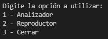

# Proyecto Autrum

<b>Estudiantes:</b><br>
Jonder Hernández Gutiérrez - 2018203660<br>
Juan Fernández Hidalgo - 2017100691 <br>
Roy Chavarría Garita - 2018034199 <br>

---

## 1 Instrucciones de instalación

### 1.1 Bibliotecas

Para utilizar correctamente la aplicación Autrum, debe de instalar las siguientes bibliotecas con los siguientes comandos:
<i>
> sudo apt install python3-pip  
> pip3 install PyAudio  
> pip3 install supyr-struct  
> pip3 install matplotlib  
> pip3 install Arrays  
> pip3 install Wave  
> pip3 install threaded  
> pip3 install os-sys  
> pip3 install pynput  
> pip3 install python-time  
> pip3 install pickle5  
</i>

## 2 El programa

### 2.1 Variables globales mas relevantes

1. chunk_size: Esta variable define el tamaño de los trozos del audio en que este será graficado en la aplicación 
2. savedData: Este es un arreglo usado para guardar todos los frames usados para la graficación del audio para su posterior guardado.
3. RATE: Es la frecuencia de muestreo, o sea, el número de muestras por unidad de tiempo.

### 2.2 Módulos

1. Menu 
2. Analizador
3. Guardado de datos
4. Reproductor

## Controles para usar Autrum

### Iniciar programa

Para iniciar el programa se usa el comando:  
```python3 Autrum.py```

### Controles

#### Menu principal


Como se observa en la imagen anterior, podemos elegir la opción de analizar presionando la tecla número 1, la opción del reproductor con la tecla número 2 o si queremos salir y cerrar el programa, selecionamos la tecla número 3.

#### Analizador

Cuando se está graficando ya sea al momento de analizar o reproducir, podemos interactuar con el programa con las siguientes teclas:

- Tecla i: Inicia la grabación en el modo de Analizador.

- Tecla P: Pausa la grabación o la reproducción.

- Tecla D: Detiene la grabación.

# Referencias:

1. Farhan, M., 2020. Latest Spectrum Analyser Using Python | Part-2. Deep Focus. Disponible en: [https://fazals.ddns.net/spectrum-analyser-part-2](https://fazals.ddns.net/spectrum-analyser-part-2)
2. De Langen, J., 2020. Playing and Recording Sound in Python – Real Python. Realpython.com. Disponible en: [https://realpython.com/playing-and-recording-sound-python](https://realpython.com/playing-and-recording-sound-python)
3. Código Pitón. 2022. Cómo Detectar la Pulsación de una Tecla en Python - Código Pitón. Disponible en: [https://www.codigopiton.com/detectar-pulsacion-de-tecla-en-python](https://www.codigopiton.com/detectar-pulsacion-de-tecla-en-python)


>imagen de solicitud de nombre del archivo

>La anterior imagen muestra un espacio para poder ingresar el nombre del archivo Autrum, se ingresa el nombre luego se presiona ENTER y automáticamente se guarda.
